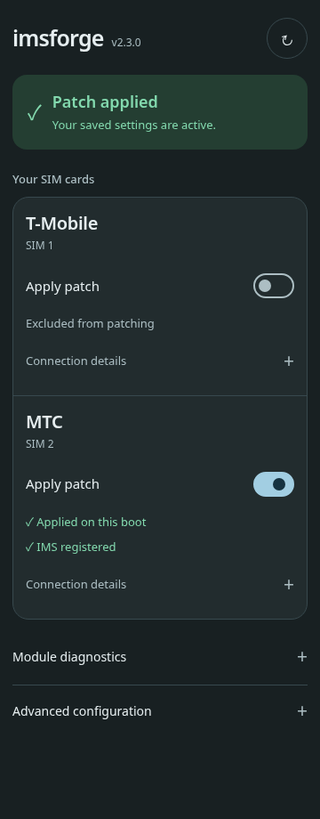

# imsforge

Enable **VoLTE, VoWiFi and VoNR** on Pixel phones for carriers Google never certified.

imsforge is a KernelSU/Magisk module that patches the CarrierSettings protobufs **on the device,
at every boot**. No computer, no per-device build, nothing to redo after an OS update — and
nothing to tap after a reboot, unlike runtime tools such as
[PixelIMS](https://github.com/kyujin-cho/pixel-volte-patch).

*[Русская версия](README.ru.md)*

---

## Why VoLTE is missing in the first place

Pixel phones do not read carrier config from the AOSP `com.android.carrierconfig` app. They read
it from Google's `com.google.android.carrier`, which parses protobuf files in
`/product/etc/CarrierSettings/`. Your carrier is looked up by MCCMNC in `carrier_list.pb`, and
its settings come either from `<canonical_name>.pb` or from the shared `others.pb`.

For a carrier Google never certified those entries contain **APNs only, with an empty `configs`
block**. So `carrier_volte_available_bool` stays `false`, IMS never registers, and calls fall
back to CSFB on 2G/3G — a real problem as carriers refarm 3G away.

There is a second half that flag-flipping tools tend to miss: such carriers usually have **no APN
of type IMS** either. Without one the IMS PDN never comes up, the network hands out no P-CSCF
(the SIP proxy address), and registration cannot even start. imsforge adds the APN in the same
patch.



## Requirements

- A Pixel (or any device using Google's CarrierSettings) with root: KernelSU, KernelSU Next,
  APatch or Magisk.
- **A mount backend.** Magisk has one built in. Since KernelSU 3.x the manager no longer mounts
  module files itself — that moved into a pluggable "metamodule", and without one installed a
  module that ships files is silently ignored: it installs, its scripts run, and nothing reaches
  the filesystem. Install [NoMount](https://github.com/maxsteeel/nomount) (kernel-level VFS
  redirection, leaves no trace in `/proc/mounts`; needs `CONFIG_NOMOUNT=y` in the kernel),
  [Mountify](https://github.com/backslashxx/mountify) (OverlayFS, any kernel) or
  [meta-overlayfs](https://github.com/KernelSU-Modules-Repo/meta-overlayfs). The module's WebUI
  says plainly when this is missing.

## Install

1. Install `imsforge.zip` in your root manager.
2. Reboot.

That is the whole procedure. Carriers of the inserted SIMs are detected and patched
automatically; carriers Google already certified are deliberately left alone, because their
config is curated and overwriting it can break working VoLTE.

## WebUI

Open the module's WebUI from the manager to see, on the phone. APatch implements the same
WebUI interface as KernelSU, so it works there unchanged; Magisk has no built-in viewer, but
[MMRL](https://github.com/MMRLApp/MMRL) and [KsuWebUI](https://github.com/a13e300/KsuWebUI)
render it for any of them:

- backend availability, completed file installation for the current boot, and what this viewer sees;
- per-slot carrier detection and draft/saved patch selection;
- current per-slot IMS registration and voice capability, with connection details on demand;
- configuration editing, validation, saving and discarding a draft.

A bottom action bar appears only for unsaved changes or a pending restart. Turning off a
carrier preserves its custom overrides for the next enable. Confirmed results are green;
an intentionally excluded SIM is neutral.

IMS state comes from current scoped ImsPhone fields, not P-CSCF or historical registration
messages. Unsupported dumps show unavailable status. The last registration transport is
labelled as a historical observation; it does not establish the current RAT or a successful call.
Files can be visible to telephony but hidden from the WebUI
by UID policy, SUSFS process marks or mount namespaces.

See [device debugging (Russian)](docs/debugging.md) for ADB, ZeroMount UID exclusions,
KernelSU profiles and byte-for-byte comparisons of stock and redirected files.

## Overrides

Optional, and only for extras: a non-standard IMS APN, additional config keys, or forcing a
carrier that detection skipped. Edit them in the WebUI, or write
`/data/adb/imsforge/carriers.json` yourself — see [carriers.example.json](carriers.example.json).
The file lives outside the module directory so that updating the module does not take your
settings with it.

```json
{
  "carriers": [
    {
      "canonical_name": "25001",
      "int_arrays": { "carrier_nr_availabilities_int_array": [1, 2] }
    }
  ]
}
```

`canonical_name` is the identifier Google uses inside CarrierSettings — for an unnamed carrier
it is just the MCCMNC. The WebUI shows the right one for every inserted SIM, and
`imsforge detect` prints it as JSON. Other keys: `ims_apn_name` (cosmetic: the label shown in
Settings → APNs, which otherwise comes from the name the SIM reports), `ims_apn_value`,
`ims_apn: false`, `bools`, `int_arrays`, plus top-level `auto: false` and `skip: ["name"]`.

An unknown key is rejected outright rather than ignored, so a typo cannot leave a setting that
quietly does nothing — but it also means a bad file stops the next boot from patching anything.
The WebUI uses `imsforge save-config` to validate stdin and atomically save it. To validate
a file without changing anything, run: `imsforge check --config /data/adb/imsforge/carriers.json`.

The key set written for each carrier mirrors what PixelIMS sets, minus
`carrier_supports_ss_over_ut_bool` — that one breaks call forwarding when the carrier's XCAP
server is unreachable.

## How it works

On every boot, `post-fs-data.sh` runs the patcher **before the mount backend lays module files
over the system**. Both implementations document that ordering — Magisk: *"Scripts run before any
modules are mounted. This allows a module developer to dynamically adjust their modules before it
gets mounted."* When the backend follows that ordering, the patch is derived from the current
stock files rather than a previous output.

The patcher then:

1. works out which carriers are in the phone. At post-fs-data the modem is not up yet, so the
   SIM properties are empty and live detection is impossible — the boot-time run instead uses the
   list `service.sh` saved once telephony was awake on the previous boot, falling back to the
   canonical names telephony leaves in its own carrier config cache. Live properties, resolved
   through `carrier_list.pb` with MVNOs matched by SPN, are used whenever the tool runs later;
2. skips carriers whose stock entry already has `carrier_volte_available_bool = true`;
3. fills in the `configs` block, adds an IMS APN labelled after the carrier name the SIM
   reports, bumps the version field (so the result is
   visible as `carrier_config_version_string` in `dumpsys carrier_config`);
4. writes into the module's own directory and relabels the files to `system_file`, because files
   created under `/data/adb` inherit a context the carrier config app cannot read;
5. deletes the carrier config cache. This is not optional: telephony invalidates that cache by
   the *version of the config app's APK*, not by the version of the protobuf data, so patched
   files would otherwise never be read.

Boot scripts call `imsforge apply`: it generates files in a sibling staging directory, checks
permissions and SELinux labels, invalidates the telephony cache, then exchanges the complete
output directory atomically. Preparation errors leave the previous files in place. Directory
exchange requires Linux `renameat2(RENAME_EXCHANGE)` support on the module filesystem; an
unsupported filesystem fails explicitly instead of deleting the previous output.

Stock snapshots live in `/data/adb/imsforge/stock`. Older generations are retained in
`stock.generations` so an older mounted output can still resolve to its own stock inputs.
Snapshots contain all standalone carrier files and are replaced as a whole. Generated output
manifests are recorded separately; producing a new output does not forget the previous one.

`apply` writes `/data/adb/imsforge/status.json` (format 2), including the boot ID, phase,
configuration fingerprint and expected files. Only completed publication is reported as applied.
`imsforge status` also checks whether the configuration changed and whether this process sees
the expected bytes. It does not infer file delivery from a VoLTE flag of another SIM.

Manual `imsforge patch --out DIR` replaces DIR with a generated result and writes its report
to `DIR/.imsforge.json` by default. It does not publish a boot-success record. An explicit
`--status FILE` can select another report path. Do not run `apply` manually after mounting
just to inspect state. Configuration names must be single safe filename components.

Protobuf surgery uses [rust-protobuf](https://github.com/stepancheg/rust-protobuf) specifically
because it preserves fields that are not in our schema. Google may add fields to CarrierSettings
at any time, and a library that drops unknown ones (prost, quick-protobuf) would silently discard
them for every other carrier in the file.

## Building

Needs the Android NDK, `cargo-ndk` and the `aarch64-linux-android` target:

```bash
rustup target add aarch64-linux-android
cargo install cargo-ndk
export ANDROID_NDK_HOME=~/Android/Sdk/ndk/<version>
./build.sh          # -> dist/imsforge.zip
```

The zip carries no carrier data. The default binary targets Android arm64; other ABIs can be
selected with `ABI`. Branch and release CI both run `bash scripts/check.sh`, including native,
CLI, WebUI and shell integration regressions.

## Layout

```
native/           the patcher (Rust)
proto/            CarrierSettings schemas from AOSP
module/           module template: scripts, module.prop, webroot/
build.sh          cross-compiles and packs dist/imsforge.zip
```

## Limitations

- Only useful where Google's CarrierSettings is what supplies carrier config — Pixels and
  devices that ship the same app.
- `vonr_enabled_bool` does something only where the carrier actually runs 5G SA.
- The APN label in Settings can lag. Telephony syncs APN rows by the config version, which
  imsforge derives from Google's, so changing an override that only affects the label leaves the
  old row in place until the stock version itself moves.
- MVNOs are matched by MCCMNC and SPN. Those distinguished only by IMSI prefix or GID1 fall back
  to the generic entry; add an explicit override if that is wrong for you.
- Verified on a Pixel 8 Pro (husky), Android 17, KernelSU Next with NoMount and later ZeroMount. This records the previous installed build;
changes still require a new boot/calling validation. Magisk is
  expected to work — it documents the same script ordering and mounts module files itself — but
  it has not been tested on a device.

## Credits

- [PixelIMS](https://github.com/kyujin-cho/pixel-volte-patch) — solves the same problem at
  runtime, and is where the carrier config key set comes from.
- [carriersettings-extractor](https://github.com/GrapheneOS-Archive/carriersettings-extractor) —
  pointed at the AOSP protobuf schemas.
- [AOSP platform/tools/carrier_settings](https://android.googlesource.com/platform/tools/carrier_settings/)
  — the schemas themselves.
- [NoMount](https://github.com/maxsteeel/nomount),
  [Mountify](https://github.com/backslashxx/mountify),
  [WildKernels](https://github.com/WildKernels/GKI_KernelSU_SUSFS) — mount backends and the
  kernels that carry them.

## License

MIT — see [LICENSE](LICENSE).
